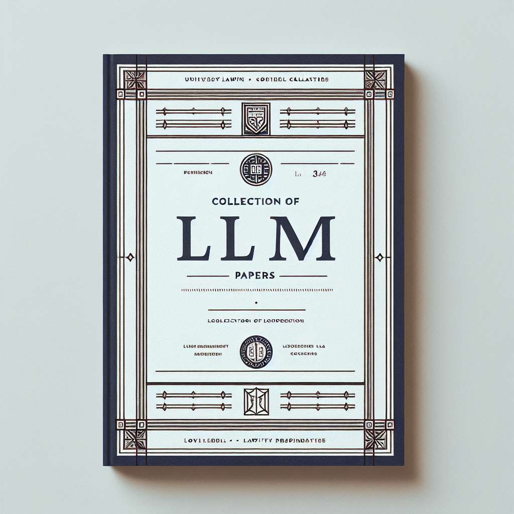

</h1>

    <h1>大预言模型中文论文精选</h1>

 Collection for LLM in Chinese 

 精选LLM论文 

随着大语言模型的发展，其在各个领域的应用越来越广泛。然而，大部分的研究成果都是以英文论文的形式发布，这对非英语母语的读者来说，阅读起来有一定的困难。本项目旨在收集和翻译LLM论文，方便更多的人了解和学习大语言模型的最新研究进展。

如果本项目能给您带来一点点帮助，麻烦点个⭐️吧～

同时也欢迎大家任何形式的贡献，无论是新增论文，还是提供翻译，或者是提出改进[建议],感谢！

## 论文列表

| 论文ID | 中文 | 原文 | 发布时间 |
| ------ | ---- | -------- | -------- |
| 2404.14387 | [大语言模型自我进化调查](https://1openwindow.github.io/llm-chinese-essay/essay/2404_14387v1/) | [A Survey on Self-Evolution of Large Language Models](https://arxiv.org/html/2404.14387v1/) | 2024-04-23 |
| 2404.15206 | [指导微调是否使LLMs更加一致？](https://1openwindow.github.io/llm-chinese-essay/essay/2404_15206v1/) | [A Survey on Self-Evolution of Large Language Models](https://arxiv.org/html/2404.15206v1/) | 2024-04-23 |
| 2404.14043 | [LLMs知道他们需要什么：利用缺失信息引导框架来增强检索增强生成](https://1openwindow.github.io/llm-chinese-essay/essay/2404_14043v1/) | [LLMs Know What They Need: Leveraging a Missing Information Guided Framework to Empower Retrieval-Augmented Generation](https://arxiv.org/html/2404.14043v1/) | 2024-04-22 |
| 2404.13033 | [样本设计工程：LLM下游微调的良好样本的实证研究](https://1openwindow.github.io/llm-chinese-essay/essay/2404_13033v1/) | [Sample Design Engineering: An Empirical Study of What Makes Good Downstream Fine-Tuning Samples for LLMs](https://arxiv.org/html/2404.13033v1) | 2024-04-19 |
| 2404.07749 | [注释作为自然逻辑的中心：通过注释视角改进代码生成](https://1openwindow.github.io/llm-chinese-essay/essay/2404_07549v1/) | [Comments as Natural Logic Pivots: Improve Code Generation via Comment Perspective](https://arxiv.org/html/2404.07549v1) | 2024-04-11 |
